# Zamanla

**Group availability scheduling without the friction.**

Zamanla helps friends, teams, and small groups find a time that works for everyone — no account required. Create a session, share one link, and watch a live heatmap reveal when the most people are free.

What sets it apart is **hybrid availability input**: participants set recurring patterns ("free on Mondays and Wednesdays after 18:00") that auto-fill the grid, then fine-tune individual slots by tapping or dragging. No tedious slot-by-slot clicking.

<p align="center">
  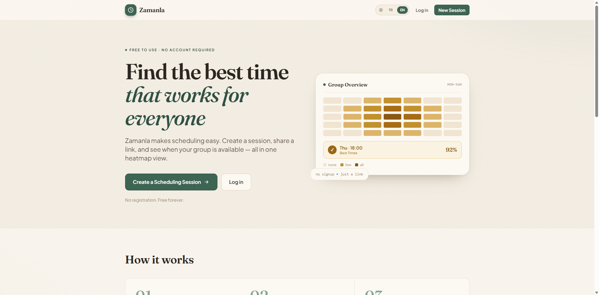
</p>

<p align="center">
  
  
  
  
  
  
  
</p>

---

## Table of Contents

- [Highlights](#highlights)
- [How It Works](#how-it-works)
- [Screenshots](#screenshots)
- [Tech Stack](#tech-stack)
- [Architecture](#architecture)
- [Data Model](#data-model)
- [Availability Logic](#availability-logic)
- [API Reference](#api-reference)
- [Local Development](#local-development)
- [Environment Variables](#environment-variables)
- [Database Migrations](#database-migrations)
- [Deployment](#deployment)
- [Design System](#design-system)
- [Internationalization](#internationalization)
- [Security](#security)
- [Roadmap](#roadmap)

---

## Highlights

- **No account required** — anonymous-first. Create a session and share a link; participants just enter a name and go.
- **Hybrid availability input** — recurring weekly rules auto-fill the grid; manual taps/drags override individual slots.
- **Live group heatmap** — aggregated availability updates as responses arrive, with the best shared times ranked to the top.
- **Timezone aware** — every participant sees times in the session's timezone; data is stored as UTC `TIMESTAMPTZ`.
- **Optional accounts** — sign in to claim sessions and manage them from a personal **My Schedules** dashboard. Accounts are never mandatory.
- **Session lifecycle** — creators can close a session to new responses (making it read-only), reopen it, or delete it.
- **Export** — download aggregated results as JSON or CSV.
- **Mobile-first interaction** — long-press + drag selection, scroll/select mode toggle, sticky save bar, and a guided onboarding tour.
- **Bilingual** — full English and Turkish localization with automatic browser-language detection.
- **Warm, calm visual identity** — a single signature theme (forest green + harvest amber, Fraunces display serif). No generic glassmorphism.

---

## How It Works

1. **Create** a session with a title, date range, daily time window, slot size, and timezone — takes about 30 seconds.
2. **Share** the generated public link with your group (and keep the private admin link to manage the session).
3. **Respond** — participants open the link, enter their name, and mark availability via recurring rules or by tapping/dragging the grid.
4. **Decide** — the group results heatmap surfaces the best overlapping times. Export them or close the session when you're done.

Two links are generated per session:

| Link | Path | Who it's for |
|---|---|---|
| **Public link** | `/s/:publicToken` | Participants — join and submit availability |
| **Admin link** | `/admin/:adminToken` | Creator — manage settings, view results, export, close/reopen/delete |

> The admin link is the only way to manage a session and **cannot be recovered if lost** (unless the session has been claimed to an account).

---

## Screenshots

### Home

| Desktop | Mobile |
|---|---|
| 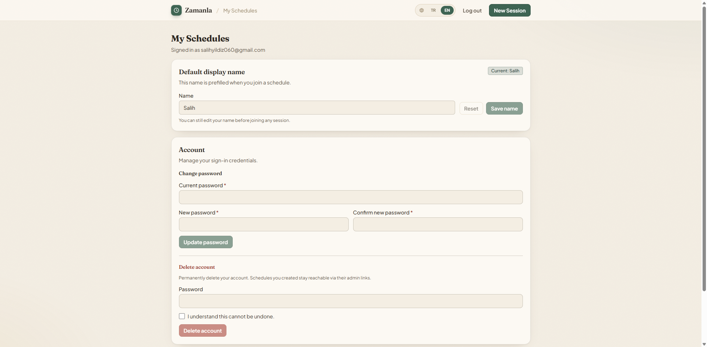 | 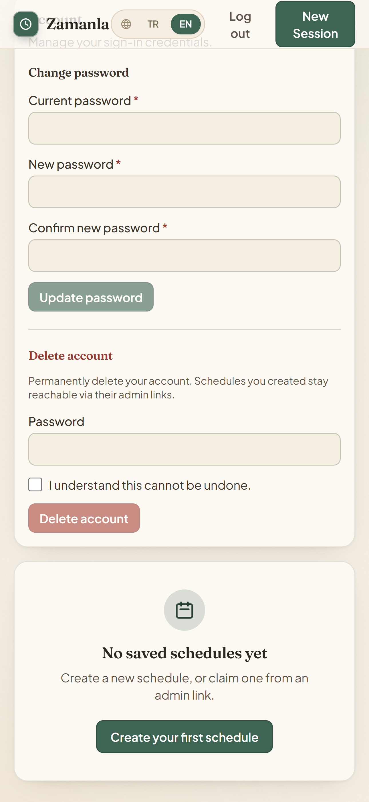 |

### Create a session

The create form with a live preview of the session card.

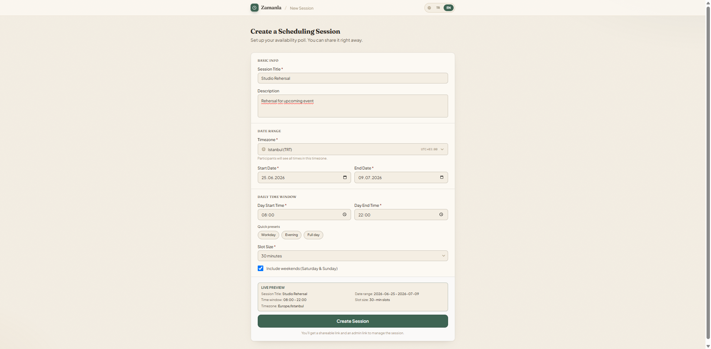

### My availability

Recurring rules auto-fill the grid; tap or drag to fine-tune individual slots.

| Availability grid | Recurring rules |
|---|---|
| 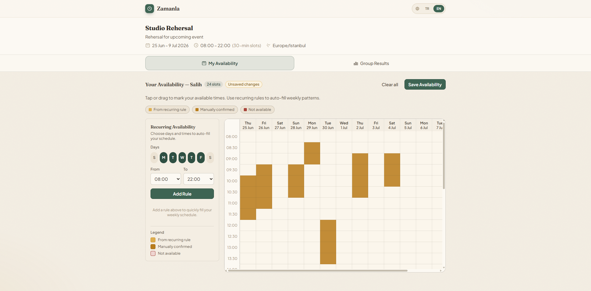 | 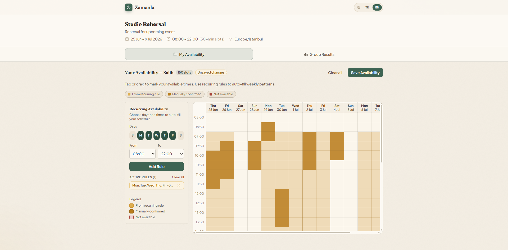 |

### Group results

A heatmap of group availability with the best shared times ranked to the top.

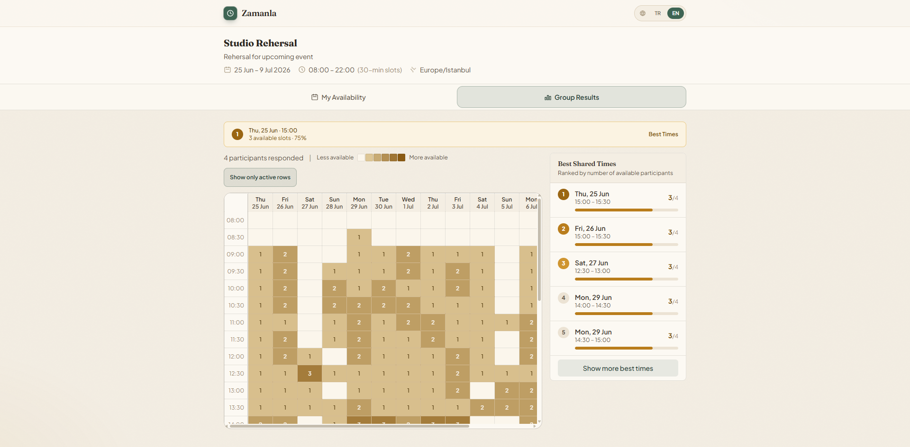

### Admin dashboard

Overview, results, and share links — plus close/reopen/delete and claim-to-account.

| Overview | Share links |
|---|---|
| 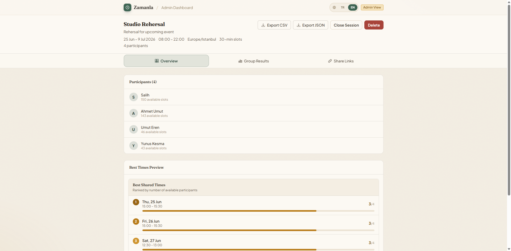 | 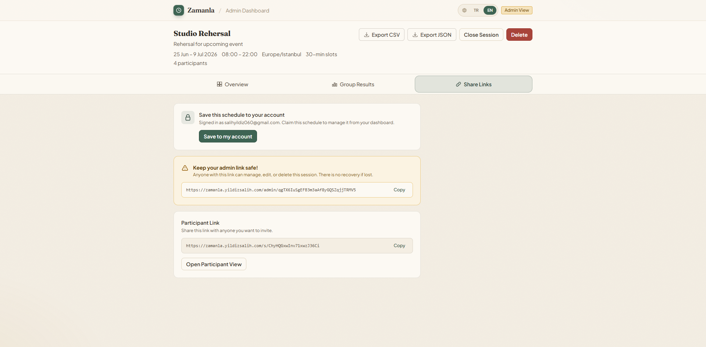 |

### Accounts (optional)

Sign in to claim and manage schedules from a personal dashboard.

| Sign in | My Schedules |
|---|---|
| 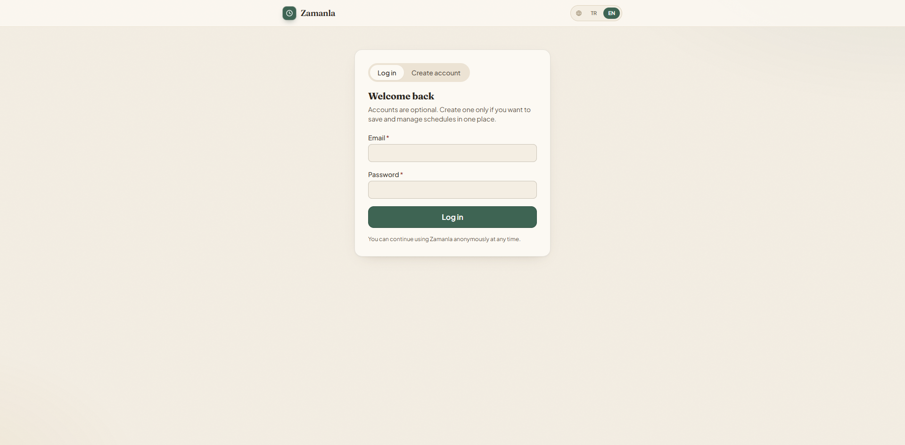 | 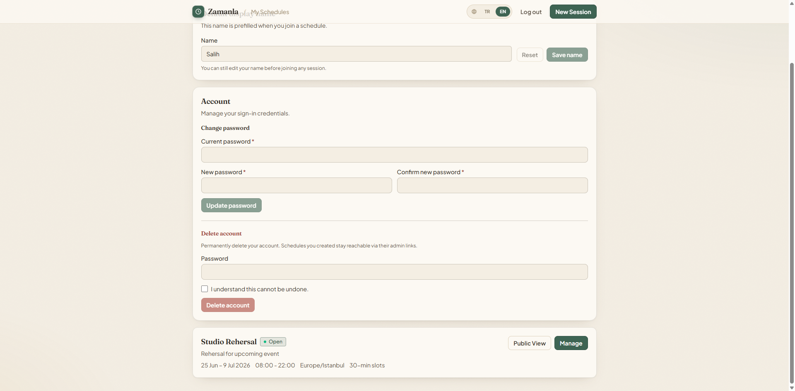 |

---

## Tech Stack

**Frontend**
- React 18 + Vite 8
- React Router 6 (lazy-loaded routes)
- TanStack Query 5 for server state
- React Hook Form + Zod validation
- Tailwind CSS 3 with a token-based design bridge
- day.js (+ timezone) for client-side time handling
- react-i18next + browser language detector

**Backend**
- Node.js 20 + Express 4
- PostgreSQL 16 via `pg` (raw SQL, layered repositories — no ORM)
- Zod for request validation
- JWT auth (`jsonwebtoken`) in an HttpOnly cookie, passwords hashed with `bcryptjs`
- Helmet, CORS, `express-rate-limit`
- `date-fns` / `date-fns-tz` for server-side timezone math
- Winston logging, `json2csv` for exports

**Infrastructure**
- Docker Compose (dev, server-dev, and prod overlays)
- Nginx reverse proxy, fronted by a Cloudflare Tunnel
- Cloudflare Turnstile (optional bot protection)

---

## Architecture

```
zamanla/
├── client/                 React + Vite frontend
├── server/                 Node.js + Express backend
├── nginx/                  Reverse-proxy configs (dev + prod)
├── scripts/                dev/deploy helper scripts
├── docker-compose.yml      Local dev (postgres + server + client)
├── docker-compose.dev.yml  Server-dev overlay (Vite HMR)
├── docker-compose.prod.yml Production (postgres + server)
├── Makefile                Shortcuts for every workflow
└── DEPLOYMENT.md           Deployment runbook
```

### Backend (`server/`)

A clean layered architecture — routes → controllers → services → repositories:

```
server/
├── index.js                       Entry point
├── migrations/
│   ├── 001_initial_schema.sql     Sessions, participants, rules, slots
│   ├── 002_users_and_ownership.sql Users + optional session ownership
│   └── migrate.js                 Migration runner (tracked in schema_migrations)
└── src/
    ├── config/                    Environment + database pool
    ├── controllers/               HTTP request handlers
    ├── middleware/                Auth, error handling, rate limiting, logging
    ├── repositories/              Database access (raw SQL via pg)
    ├── routes/                    Route definitions
    ├── services/                  Business logic (aggregation, availability, auth)
    ├── utils/                     Tokens, time, cookies, response helpers
    └── validators/                Zod input schemas
```

### Frontend (`client/`)

```
client/src/
├── components/
│   ├── availability/   AvailabilityGrid, RecurringRuleForm, ParticipantEditor
│   ├── common/         Button, Input, Select, Modal, Toast, Brand, TurnstileWidget…
│   └── results/        ResultsHeatmap, BestTimesPanel
├── hooks/              useSession, useParticipant, useAuth, useSchemas (TanStack Query)
├── i18n/               i18next config + en/tr locale files
├── pages/              Home, CreateSession, Session, Admin, Auth, MySchedules, NotFound
├── services/           Axios API client
└── utils/              Slot generation, timezone, heatmap colors, theme
```

---

## Data Model

```
users ──< sessions ──< participants ──< availability_rules
                          │
                          └──< availability_slots
```

- **`sessions`** — title, description, timezone, date range, daily window, slot size, `include_weekends`, `is_closed`, and an optional `owner_id` (NULL for anonymous sessions). Holds a `public_token` and an `admin_token`.
- **`participants`** — name + a unique `edit_token`, scoped to a session.
- **`availability_rules`** — recurring patterns (`weekdays[]`, `start_time`, `end_time`); expanded into slots server-side.
- **`availability_slots`** — concrete `slot_start`/`slot_end` with a `status` (`available` / `unavailable`) and `source_type` (`rule` / `manual`). Manual entries override rule-derived ones.

Time slots are **not** persisted per session — they're generated dynamically from session metadata. Rules are stored once and expanded across the date range on save.

---

## Availability Logic

Three input modes compose into a single saved state:

1. **Recurring rules** — e.g. "free Mon/Wed after 18:00" — stored in `availability_rules` and expanded across the session's date range.
2. **Manual selection** — direct tap/drag on the grid — stored as explicit `availability_slots`.
3. **Manual overrides** — tapping a rule-filled slot to remove it — stored as `status = 'unavailable'`.

**Priority:** manual overrides > rule-derived slots.

**Aggregation** counts available participants per slot, then ranks slots by that count to surface the best shared times.

---

## API Reference

All responses share an envelope:

```json
{ "success": true,  "data":  { ... } }
{ "success": false, "error": { "code": "SESSION_NOT_FOUND", "message": "Session not found." } }
```

### Sessions

| Method | Path | Description |
|---|---|---|
| `POST` | `/api/sessions` | Create a session (optional auth → sets `owner_id`) |
| `GET` | `/api/sessions/:publicToken` | Public session details |
| `GET` | `/api/sessions/admin/:adminToken` | Admin view (participants + results) |
| `PATCH` | `/api/sessions/admin/:adminToken` | Update session settings |
| `DELETE` | `/api/sessions/admin/:adminToken` | Delete session |
| `POST` | `/api/sessions/admin/:adminToken/close` | Close session to new responses (read-only) |
| `POST` | `/api/sessions/admin/:adminToken/reopen` | Reopen a closed session |
| `POST` | `/api/sessions/admin/:adminToken/claim` | Claim session for the logged-in account |
| `GET` | `/api/sessions/:publicToken/results` | Aggregated group availability |
| `GET` | `/api/sessions/admin/:adminToken/export` | Export results (`?format=json\|csv`) |

### Participants

| Method | Path | Description |
|---|---|---|
| `POST` | `/api/sessions/:publicToken/participants` | Join a session (creates a participant + edit token) |
| `GET` | `/api/sessions/:publicToken/participants/:editToken` | Participant + their availability |
| `PUT` | `/api/sessions/:publicToken/participants/:editToken` | Save availability (rules + slots) |

### Auth (optional)

| Method | Path | Description |
|---|---|---|
| `POST` | `/api/auth/register` | Create account and start an auth session |
| `POST` | `/api/auth/login` | Log in and start an auth session |
| `POST` | `/api/auth/logout` | Log out and clear the auth cookie |
| `GET` | `/api/auth/me` | Current authenticated user (or `null`) |
| `POST` | `/api/auth/change-password` | Change password (authenticated) |
| `POST` | `/api/auth/delete-account` | Delete account (authenticated) |

### My account

| Method | Path | Description |
|---|---|---|
| `GET` | `/api/my/schedules` | List schedules owned by the authenticated user |

---

## Local Development

### Prerequisites

- Docker + Docker Compose
- Node.js 20+ (only if running outside Docker)

### Quick start (Docker Compose)

```bash
cd zamanla

# Copy environment config
cp .env.example .env

# Start everything (postgres + server + client)
docker compose up --build

# Run migrations (first time only)
docker compose exec server npm run migrate
```

- **Frontend:** http://localhost:9050
- **Backend API:** http://localhost:9051/api
- **PostgreSQL:** localhost:9052

The `Makefile` wraps the common workflows — run `make help` to see them all (`make up`, `make down`, `make logs`, `make migrate`, …).

### Without Docker

```bash
# 1. Start just the database
docker compose up postgres -d

# 2. Server
cd server
cp ../.env.example .env      # edit as needed
npm install
npm run migrate
npm run dev

# 3. Client (new terminal)
cd client
cp ../.env.example .env      # edit as needed
npm install
npm run dev
```

### Tests

```bash
cd server
npm test                     # node:test — session flow, auth, ownership, account
```

---

## Environment Variables

| Variable | Default | Description |
|---|---|---|
| `DB_HOST` | `localhost` | PostgreSQL host |
| `DB_PORT` | `9052` | PostgreSQL port |
| `DB_NAME` | `zamanla` | Database name |
| `DB_USER` | `zamanla` | Database user |
| `DB_PASSWORD` | *(required)* | Database password |
| `NODE_ENV` | `development` | `development` or `production` |
| `PORT` | `9051` | Backend server port |
| `CORS_ORIGIN` | `http://localhost:9050` | Allowed CORS origin(s), comma-separated |
| `AUTH_JWT_SECRET` | `dev-only-change-me` | JWT signing secret for optional account auth |
| `AUTH_JWT_EXPIRES_IN` | `7d` | JWT expiration (e.g. `7d`, `12h`) |
| `AUTH_COOKIE_NAME` | `zamanla_auth` | Auth cookie name |
| `AUTH_COOKIE_MAX_AGE_MS` | `604800000` | Auth cookie max age (ms) |
| `TURNSTILE_SECRET_KEY` | *(optional)* | Cloudflare Turnstile secret key |
| `VITE_API_URL` | `http://localhost:9051/api` | Frontend API base URL |
| `VITE_TURNSTILE_SITE_KEY` | *(optional)* | Cloudflare Turnstile site key |

---

## Database Migrations

Migrations live in `server/migrations/`. The runner tracks applied migrations in a `schema_migrations` table, so it's safe to run repeatedly.

```bash
npm run migrate                          # from server/
docker compose exec server npm run migrate   # via Docker
```

---

## Deployment

Zamanla is built to run behind a reverse proxy, fronted by a Cloudflare Tunnel (nginx listens on port 80; SSL is terminated at Cloudflare).

| Service | Port | Notes |
|---|---|---|
| Frontend | 9050 | Vite dev server / static `dist` in production |
| Backend API | 9051 | Express server |
| PostgreSQL | 9052 | Exposed on host for development |

**Production environment** (set in `.env`):

```env
NODE_ENV=production
CORS_ORIGIN=https://zamanla.yildizsalih.com
VITE_API_URL=/api
DB_PASSWORD=<strong-random-password>
AUTH_JWT_SECRET=<strong-random-secret>
TURNSTILE_SECRET_KEY=<from-cloudflare>
VITE_TURNSTILE_SITE_KEY=<from-cloudflare>
```

> In production the frontend is built with a **relative** `VITE_API_URL=/api` so nginx can route `/api/*` to the backend on the same origin — not the dev `localhost` URL.

The reverse proxy should:
- Route `/api/*` → backend on port 9051
- Route `/*` → the built frontend static files in `/var/www/zamanla/dist`

**Deploy commands** (see `DEPLOYMENT.md` for the full runbook):

```bash
make build            # build frontend with VITE_API_URL=/api
make deploy-frontend  # rsync client/dist → /var/www/zamanla/dist
make restart          # rebuild + restart the production backend
make deploy-prod      # full deploy: pull + build + deploy + restart + migrate
```

---

## Design System

Zamanla ships a single, signature **"warm organic / calm"** theme — deliberately away from generic indigo/blue glassmorphism.

- **Palette — "forest + harvest amber":** warm paper/ink neutrals (`sand`), deep green (`forest`) for brand/chrome/positive actions, and harvest gold (`amber`) for availability and density (heatmaps, counts, best times). `brick` for danger.
- **Typography:** **Fraunces** (serif) for display headings; **Plus Jakarta Sans** for body text.
- **Texture:** soft warm shadows and a faint paper grain — no neon blobs, no blur.

Design tokens live in `client/src/index.css` (`:root`) and are mirrored as real Tailwind colors in `tailwind.config.js`. A Tailwind-override "bridge" re-maps legacy utility classes (`indigo`/`emerald`/`teal` → `forest`, `red` → `brick`) so existing markup inherits the identity. The app is light-theme only; the theme switcher has been retired.

---

## Internationalization

- **Languages:** English (`en`) and Turkish (`tr`).
- **Library:** react-i18next + `i18next-browser-languagedetector`, initialized synchronously before React renders.
- Browser locales like `tr-TR` resolve to `tr` via `load: 'languageOnly'`; preference persists in `localStorage` (`zamanla_language`).
- day.js locale is kept in sync on language change, so dates and day names localize alongside the UI.

---

## Security

- **Tokens:** public `21`-char nanoid (~126 bits), admin `32`-char nanoid (~192 bits), per-participant edit `21`-char nanoid — all URL-safe.
- **Input validation:** every payload validated server-side with Zod schemas.
- **Auth:** optional JWT in an HttpOnly cookie (`SameSite=Lax`, `Secure` in production); passwords hashed with bcrypt.
- **Rate limiting:** session creation, participant join, auth, export, and general traffic each have their own limiter.
- **Turnstile:** optional Cloudflare Turnstile on session creation and participant join.
- **Headers & CORS:** Helmet on every response; CORS locked to the configured origin(s).

---

## Roadmap

The schema and service layer are designed to grow into a fuller product without a rewrite:

- Calendar integrations — export to `.ics`, Google Calendar sync
- Email notifications when a session is finalized
- Team / workspace support (workspace-scoped sessions)
- Branded scheduling pages (custom slug + branding)
- Subscription tiers + usage limits as middleware
- Audit logs via service-layer hooks

---

<p align="center"><em>Simple, open scheduling — no account required.</em></p>
